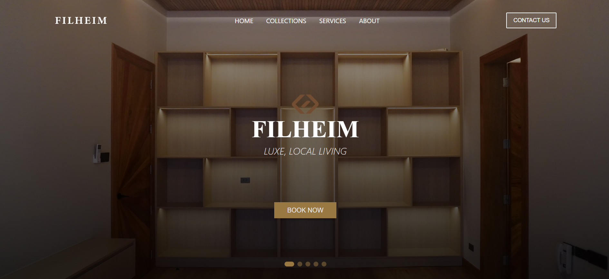
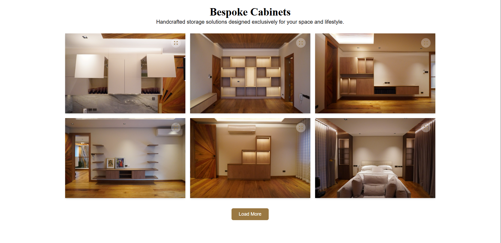
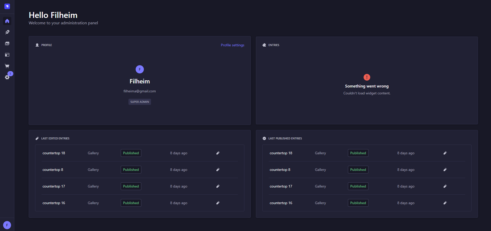

# Bespoke Cabinetry Website

A **premium woodworking brand** website built with **Next.js** and **Strapi**, featuring a **modern, responsive design** and an easy-to-manage content management system.  
Crafted to showcase **custom furniture** with elegance and high performance.

---

## ✨ Features

- **Responsive UI** – Optimized for mobile, tablet, and desktop.
- **Dynamic Content** – Easily managed via Strapi CMS.
- **High Performance** – Built with Next.js for fast, SEO-friendly pages.
- **Custom Furniture Showcase** – Beautifully highlights bespoke designs.
- **Optimized Images** – Sharp, fast-loading visuals for every device.

---

## 🖼️ Screenshots

**Homepage**

**Project Showcase**

**CMS Dashboard**

---

## 🛠️ Tech Stack

**Frontend**
- [Next.js](https://nextjs.org/)
- [React](https://reactjs.org/)
- [Tailwind CSS](https://tailwindcss.com/)

**Backend**
- [Strapi](https://strapi.io/) (Separate repo: [devjeiku/filheim-strapi](https://github.com/devjeiku/filheim-strapi))
- REST API & Media Handling

**Deployment**
- [Vercel](https://vercel.com/)

---
